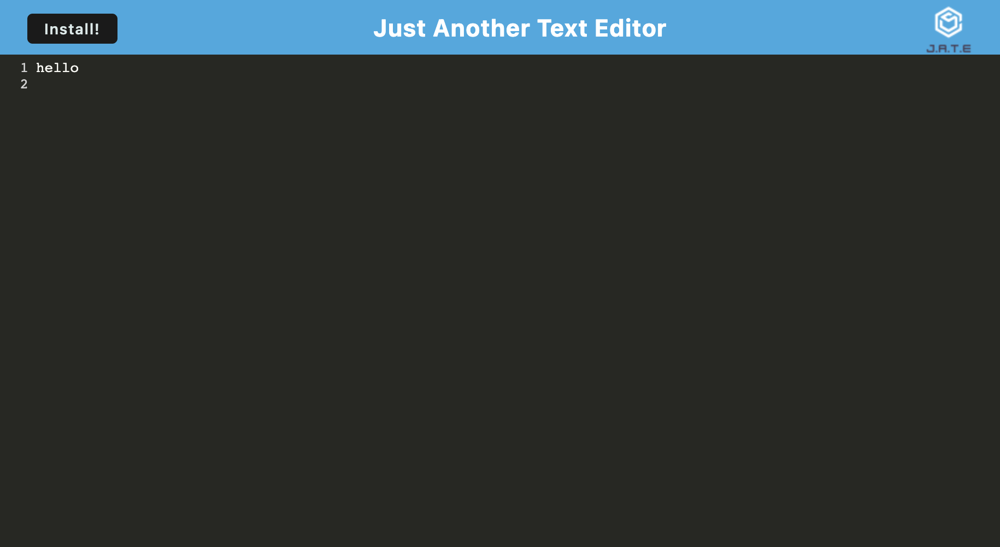

# Module 19 Challenge: Text Editor 

## Description

This project was built to design an application that can manage notes to be added and edited. The application uses service workers so that it can be fully functional even when the user's device is not connected to a network. The notes are stored in an indexDB so it can be accessed when the page is refreshed or again, when the network is offline. This project allowed me to understand the use of progressive web applications. 

## Usage

Once the webpage is opened, the user may simply add notes by typing with their keyboard and adding their desired comments into the lines. 

## Deployed Application

The live page is found at https://sagirikenaga.github.io/coding-quiz/. 

## Demo

The webpage appears as the following:

## Credits

Sagiri Ikenaga

